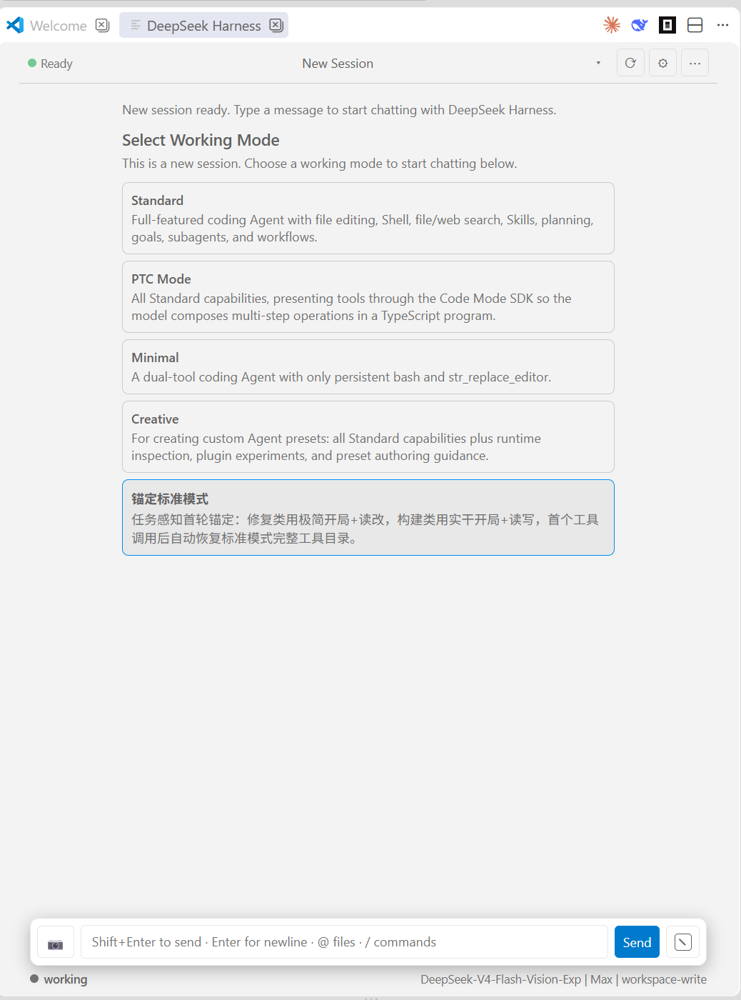

# DeepSeek Harness Chat (dsh-vsc-weblike)

[中文](#中文) | [English](#english)

> VS Code 1.136 远程窗口下扩展文件图标（SVG/PNG）无法正常渲染：活动栏与编辑器标题按钮已改用 VS Code 内置 codicon（`$(comment-discussion)`），任何环境均可显示；入口均可正常点击使用。

将 DeepSeek Harness（dsh）的能力接入 VS Code，提供 Claude Code 风格的侧边栏与工作区面板界面。插件不内嵌 dsh Web 前端，而是通过 HTTP RPC 与单 WebSocket Remote mux（`/api/remote.mux`）直接与 dsh 后端通信。

> 由于本人测试环境有限，陆陆续续发现了很多 BUG；如遇恶性 BUG，请邮件 ysen96@qq.com，我将尽快修复。

> 插件 **1.1.2** 需要 dsh 升级到 **0.1.5**（Typert Remote 协议 + 进程内 assistant-stream + 首次启动 token 认证）；低于 0.1.5 的旧版 dsh 不再兼容（命令执行参数、助手实时输出协议均已变化）。dsh alpha 通道的快速破坏性版本暂不对其适配。
>
> 各插件版本与 dsh 版本的对应关系见下文「三、运行环境」中的对应表。

Bring DeepSeek Harness (dsh) into VS Code with a Claude Code-style sidebar and workspace panel. The extension does not embed the dsh web frontend; instead it talks directly to the dsh backend over HTTP RPC and a single WebSocket Remote mux (`/api/remote.mux`).

> Due to a limited testing environment, bugs have surfaced over time. If you encounter a critical bug, please email ysen96@qq.com and I will fix it as soon as possible.

> Extension **1.1.2 requires dsh >= 0.1.5** (Typert Remote protocol with the in-process assistant stream and launch-token authentication); older dsh releases below 0.1.5 are no longer supported (command-execution arguments and live assistant output both changed). Rapid breaking changes on the dsh alpha channel are not adapted for now.
>
> See the compatibility table under "3. Requirements" below for the extension ↔ dsh version mapping.

> In VS Code 1.136 remote windows, extension file icons (SVG/PNG) fail to render: the activity bar and editor title button now use a built-in codicon (`$(comment-discussion)`), which renders in any environment; all entries remain clickable.




---

## 中文

### 一、核心功能

#### 1. dsh 实例生命周期管理
- 自动发现 dsh：配置路径 `dsh-vsc.dshPath` → `PATH` → npm 全局目录 → `npx --no-install @deepseek-ai/dsh`。
- 启动前检查是否已有 dsh web 在后台运行（优先级从高到低）：
  - 显式 `dsh-vsc.dshUrl`
  - 默认地址 `http://127.0.0.1:3080`（用户手动启动的实例优先）
  - 状态文件 `~/.dsh/vscode-extension.json`（上次插件实例仍存活时的兜底）
- 若默认端口已有 dsh 服务但需要 token 认证（rc.1 起每次启动 token 不同），插件会弹输入框请你粘贴 dsh 启动输出的完整 URL（含 `?token=...`）；粘贴后直接复用该实例；取消则按下面的自动启动设置决定是否自建实例。
- **启动插件时自动启动 dsh 后端**（`dsh-vsc.autoStart`，默认开）：未发现可复用实例时自行拉起 `dsh web --port 0 --no-open`（随机 loopback 端口，不打开浏览器）。
  - 自动启动的后端与手动启动的后端并存时可能出现 **session 冲突**：插件在设置面板勾选该项时会提示"自动启动的 dsh 后端可能会导致 session 冲突，请谨慎使用。"，启动行为分区常驻提示"推荐手动启动 dsh 后端服务。"。
  - 关闭该项后插件只复用已手动运行的后端（默认 3080），未发现实例时保持"已停止"状态、不报错；此时推荐在终端自行 `dsh web` 后用状态点或设置重新连接。
- VS Code 关闭时，自动退出由插件启动的 dsh 实例；复用已有实例时仅断开连接。
- 状态徽标实时显示：发现中 / 启动中 / 就绪 / 重连中 / 停止 / 错误；停止/错误状态可点击重新检测 dsh web 实例。

#### 2. 工作区与会话管理
- 自动将当前 VS Code 工作目录加入 dsh 工作区。
  - 已存在：按 canonical path 匹配后直接使用。
  - 不存在：打开插件界面时弹出确认框（启动阶段不打扰，后台静默初始化），经用户确认后创建。
  - 未添加工作区时，聊天区显示"没有打开的工作区，无法开始会话。"提示及"将当前文件夹添加到DSH工作区"按钮，点击后重新弹出确认框。
  - VS Code 工作区文件夹变化时自动重新映射。
- 会话列表、选择、新建、重命名、fork（复制会话）。
- 会话显示名与 dsh Web 端一致：`title` 投影 → 工作目录名 → 会话 id（空白会话显示"新会话"）；不再出现网页显示目录名、插件显示"会话 1a2b3c4d"的差异。
- 会话列表按**最近修改时间**降序排列：dsh `session/list` 的 `updatedAt` 只等于 `max(创建时间, 最近一次发送提示词时间)`（`sessionListMetadata` 只有 `lastPromptAt`），插件额外记录了观察到的活动时间（`api-session/activity` 的提示词时间、`api-session/status` 开始/结束运行的时间、当前会话每来一条新事件的时间），取两者较大值后排序并显示相对时间——所以正在被模型修改的会话会保持/回到列表最前，相对时间也不会停在"上次发提示词"那一刻。
- 会话行右侧显示**会话模式**标签（如"标准模式""PTC 模式""锚定标准模式"）：名字优先取 dsh 的 `agentPresets/list`（自定义 preset 也有名字），其次内置 id 的中文/英文短名；没有模式的会话不显示；**面板宽度 < 480px 时自动隐藏**（宽度足够才显示），标签最多占行宽 45% 且超长省略，不会挤压会话标题。
- 会话列表**不区分分支会话与普通会话**：dsh 的 `session/fork` 会给子会话写 `parentSession`（所以它出现在 dsh 的会话谱系里），但插件把它按普通会话显示——不缩进、不加任何"分支"标记、fork/重命名/归档操作与其它会话完全一致。只有 **子代理会话**（`origin: 'subagent'`，含子代理再派生的子代理）会缩进挂在父会话下方、标注"子代理会话"且仅可选中查看。
- **子代理会话可"提升为普通会话"（仅插件视图）**：鼠标悬停子代理行点 **⇧**，它在抽屉里就作为顶层会话显示（点 **⇩** 恢复嵌套），集合持久化在 VS Code 全局状态。dsh 的谱系只写在创建时的 header（`parentSession`）里且**没有修改接口**（RPC 面只有 create/rename/fork/prompt 等，没有 detach/promote），所以这只改变插件抽屉的显示层级，dsh Web UI 里的层级不受影响。
- 归档会话：dsh 无 unarchive API，插件提供"取消归档（仅插件视图，↩）"与抽屉里的"显示已归档 / 隐藏已归档（按钮文案 = 点击后会做什么：归档会话未显示时写"显示已归档"，已显示时写"隐藏已归档"，与设置里的 `dsh-vsc.showArchivedSessions` 同一状态、可反复切换）"（本地集合持久化在 VS Code globalState，不影响 dsh 状态）。按钮上会带数量（如"显示已归档（13）"）；若该工作区的归档会话**全部**已被"本地恢复显示"，就没有可切换的会话，按钮 tooltip 会说明原因并指向设置里的"清除仅插件内显示"。这类会话在列表里标为"**已归档会话（仅插件内显示）**"（悬停有说明）——它们**在 dsh 里确实是归档状态**，dsh 没有取消归档接口、网页端也把归档会话直接过滤掉（`ui-workspace` 的会话树用 `archivedSessionIds` 过滤），所以**只有在插件里能看到**；设置 → 管理工作区里有"清除"仅插件内显示"（N）"可一次性撤销（旧版"隐藏已归档"按钮曾把全部归档会话写进本地集合，一键即可清理）。
- 长会话分页：初始只挂载最近 500 条（宿主裁剪"已加载窗口"，超出部分不留在内存里）；列表顶部的"加载更早"是**唯一**的向前翻页入口，点击时向 dsh 请求更早一页（`session/page`）并插入到顶部，同时保持当前阅读位置不跳走。
- **设置 → 赞助**：页首标语"**为爱发电，永久免费，如果此插件合您心意，请随意打点。**"，下面是微信/支付宝收款码（`sponsor/wx.jpg`、`sponsor/zfb.jpg` 以 data URI 内嵌进 webview，离线可用、不依赖 `asWebviewUri`；点图片放大到 2 倍方便手机扫码），文案说明"完全自愿，不影响任何功能"。
- 顶栏：会话标题 + 状态点 + 刷新/设置/⋯；刷新按钮是一次"轻量全量刷新"（会话列表 + 模型目录 + 命令目录 + 工作模式 + 设置快照，**不重载会话历史**），刷新期间按钮转圈并禁用；dsh 未就绪时保留当前列表并提示"dsh 尚未就绪"、同时自动重新探测连接；点击会话标题打开 Sessions 抽屉（搜索 + New Session + 会话列表，每行显示工作中/已归档/相对时间与 fork/重命名/归档操作）；新建会话入口在抽屉内。
- 抽屉搜索：标题即时本地过滤；输入 ≥2 字符再防抖调用 dsh `session/search` 做会话内容检索，命中额外列出“内容匹配”分区（会话 + 摘要，点击直接切换）。dsh 默认关闭全文索引（`openAt: never`）时自动降级为纯标题过滤。
- Sessions 抽屉标题旁提供“未分组”勾选：勾选后列出 `cwd` 与当前工作区一致的未分组会话（未被任何工作区记账），可逐条“加载到当前工作区”或一键“全部加载”。
- 首次创建工作区且无会话时，自动创建并选中空白"新会话"（不再显示"暂无会话"），聊天区显示"新会话已就绪。输入消息开始与 DeepSeek Harness 对话。"及工作模式选择。
- 新会话 Hero：问候语 + 工作模式卡片（标准 / PTC / 极简 / 创造）；点击卡片立即高亮选中并写入该会话的工作模式（`agentPreset`，读取 dsh 的 `agentPreset` 投影），选择失败会弹出提示。dsh 关闭 `modeSelectionEnabled` 时不再显示模式卡片。
- 设置弹窗采用 VS Code 设置风格卡片（分组/卡片化）；窄面板（≤600px）自动收紧顶栏/聊天区/composer 内边距。dsh 未启动时设置弹窗仍可打开，可修改本地显示/常规设置，工作区管理页签仅在已连接时显示。
- 归档/关闭会话：操作前二次确认；归档后仅从会话列表移除，不再保存会话副本到工作区。
- 会话标题 fallback 优化，不再显示裸 `session-`。

#### 3. 聊天界面与会话内容显示
- 简洁会话 / 详细会话两种模式，默认简洁。
  - 简洁模式隐藏工具调用与思考流程，只保留用户、Assistant 最终输出与命令节点。
  - 详细模式（web 端风格时间线）：工具调用显示为单行 `✍️ Write file.ext`（路径只显示文件名、无下划线，点击展开参数与结果，错误显示 `❌` 红字）；思考过程显示为单行 `💭 Think · 预览`（换行折叠为单行，点击展开完整思维链），流式思考为 `💭 Thinking · …`；回合结束时若成功修改了文件，会像 dsh web 端一样显示 **产物** 列表（文件名 chips，点击在 VS Code 中打开；超过 5 个显示 `+N`）。
  - 简洁模式下底部统计行为同一行：左侧常驻 `working` 标识（圆点颜色表示会话状态：灰 = 空闲、绿 = 思考中、红 = 工具调用中、蓝 = 输出中）、居中 LLM 统计信息（缓存命中 / 输入输出）、右下角当前模型与推理强度。
- 流式 Assistant 输出。
- 工具调用与工具结果按 `callId` 配对。
- `/` 命令执行结果以命令节点展示（`command/run` → `command/done`，含成功/失败信息）。
- 上下文注入（AGENTS.md 指令、插件注入、会话引用、技能内容等）在详细模式中逐条显示，默认折叠；摘要跳过 `<system-reminder>` 这类包裹标签，取第一行有效内容（取不到时按来源标注，如"上下文注入：项目指令"）。完全相同的重复注入只保留一条；简洁模式不显示。
- 向上翻页时提供“加载更早”按钮，按需加载更早历史。
- Markdown 渲染：
  - 标题、段落、粗体、斜体、删除线。
  - 行内代码与围栏代码块（可带语言 class），并对常见语言提供轻量语法高亮（关键字/字符串/注释/数字）。
  - 有序/无序列表（可嵌套）。
  - 引用块、分割线。
  - GFM 表格（支持对齐）。
  - 链接、图片。
  - 轻量 LaTeX 公式子集：`$...$` 行内公式、`$$...$$` 块级公式、分式、根号、上下标、希腊字母、常见运算符。
  - HTML 先转义再渲染，保证内容安全。

#### 4. Composer 输入区
- 发送方式可配置：
  - `Shift+Enter` 发送，`Enter` 换行（默认）。
  - 或反过来：`Enter` 发送，`Shift+Enter` 换行。
- 停止按钮使用 `■` 图标。
- `@` 文件引用：输入 `@` 弹出当前工作区文件列表，实时过滤。
- 图片发送（vision，两种方式）：① 输入框粘贴截图/图片（PNG/JPEG/WebP）；② 输入框左侧 **📷 选择图片**按钮（打开本地文件对话框，本机/远程环境都可靠）。图片会以缩略图显示在输入框上方（可逐张移除，发送按钮显示数字角标，添加成功有"已添加 N 张图片"提示），发送时随消息作为 `image` 附件提交给模型（配合 `deepseek-v4-flash-vision-exp` 等视觉模型使用）；部分远程环境剪贴板拿不到图片文件时会自动尝试 Clipboard API 兜底；若命令不接受图片附件会在发送前提示。（拖拽添加图片因 VS Code webview 平台限制不稳定，已移除。）
- `/` 命令菜单：输入 `/` 弹出 dsh 命令列表。
- `/` 命令执行：发送以 `/` 开头的完整命令行时直接调用 `commands/execute`——已注册命令被 host 执行（不会作为普通对话发给模型，结果以命令节点显示在会话中）；未注册命令返回空（`undefined`），与 web 端一致按普通消息发送；旧版 dsh 不支持命令 RPC 时自动回退普通消息。
- 发送队列显示：显示“排队中”队列，支持编辑、插话（steer）、删除。
- 动作按钮：输入框右侧的"方框斜杠"按钮，点击打开一个简单卡片，仅含 **模型 / 推理** 选择与 **权限/模式** 列表（不调用 VS Code 原生选择器，也不用搜索式动作弹层）；点选权限即切换并关闭。
- 发送按钮：位于输入框右侧，文字"发送"；带 N 张图片时在按钮内显示一个小数字徽标。
- Composer 整体为一个圆角胶囊区域；输入框默认带外边框；面板宽度 <900px 时，底部统计行隐藏中间"缓存命中 / LLM 用量"，保留左侧 `working` 与右下角模型/权限信息。
- 附件：📷 粘贴/选择图片；📎 选择任意文件（0.1.5 `file-upload`，发送前自动上传换收据并以 `{type:'file',receiptId}` 进入 prompt）。
- **悬浮提示词暂存框**（`dsh-vsc.promptStash`，默认开启）：输入框上方右侧的悬浮层，用于预先写下"接下来准备发送的提示词"，**数量不限**，用 composer 行**右侧**（发送按钮之后）的 **＋** 逐个增加——**输入框里有文字/待发送图片时，＋ 会把它们一起存进新暂存框并清空 composer**（多行内容原样保存，只是单行框显示不下换行；图片在行内显示为缩略图，最多 3 张、更多显示 `+N`，每张缩略图都可以单独 `×` 移除），输入框为空时则新建一个空框；悬浮层自带限高滚动，堆多了也不会盖住整屏。**图片会随暂存框一起持久化**（存在 VS Code 全局状态里，重启/换窗口后仍在），发送时文字与图片一起作为一条消息提交给会话。每个槽位是固定高度的单行框（不自动换行，只显示能显示出来的内容），右侧按钮（或在该框内按 **Enter**）把该条提示词直接发送到当前会话——**发送后该暂存框即被删除**（剩下的框上移重新编号，焦点回到输入框）；也可以点 **×** 手动移除该框。功能开启时，输入框占位符里会多出"**· Ctrl+Shift+Enter 暂存**"提示（功能关闭时不显示），在输入框里按 **Ctrl+Shift+Enter**（macOS 上 Cmd+Enter）可直接把当前内容（文字+图片）暂存到一个新框——输入框为空时该快捷键不做任何事；暂存后焦点仍在输入框，方便接着写吓一条。内容持久化在 VS Code 全局状态（重启/换窗口后仍在），关闭开关只隐藏界面、不清空内容；待回答问题/审批时随输入行一起收起。开关位置：设置 → 通用 → 提示词暂存框。
- 上下文占用：以输入框背景按占用比例填充显示，悬停输入框可见具体百分比；可在设置中关闭，并可自定义进度条颜色（默认与用户消息框同色）。
- 底部统计行（同一行，左起 working 指示器、居中缓存命中与输入输出、右下角当前模型与推理强度 + 当前权限；存在运行中的后台任务时显示“{n} 个后台任务”，点击可展开任务列表；会话有目标/计划模式时，聊天区顶部显示横幅，目标横幅可用 × 关闭——关闭后该目标不再显示，目标更新（objective/phase/轮次变化）时自动重新出现）：
  - 中文：`缓存命中 42% | 输入 12.3K tokens · 输出 2.1K tokens`
  - 英文：`cache hit 42% | input 12.3K tokens · output 2.1K tokens`
  - 右下角模型信息：`Deepseek V4 Flash | Max | workspace-write`（模型名 | 推理强度 | 当前权限，缺失部分省略）。

#### 5. 工具审批 / 计划条 / 权限 / 问题 / 命令节点
- 工具审批（Approval）：输入框区域切换为审批面板，支持 `允许一次` / `拒绝`。
- 计划条（Todo）：展示计划列表与状态统计。
- 权限选择（Permission）：读取 dsh `permissions` 投影，切换时执行 `/permission <preset>`。
- 命令节点：`/` 命令执行后，会话中显示命令行与执行结果（成功/失败），简洁模式同样保留。
- 问题与计划评审：
  - Plan Review：支持批准 / 拒绝 / 聊一聊。
  - Ask User：支持单选、多选；带选项的问题同时提供"自定义回答"输入框（单选时自定义回答优先于选项，多选时两者可同时提交），无选项的问题直接自由输入。

#### 6. 设置面板
- 打开方式：点击顶部 `⚙`。
- 会话显示模式：简洁 / 详细。
- 字体大小：12–20 px。
- 内容最大宽度：不限制 / 800 / 1000 / 1200 / 1600 px（大屏时内容居中，不占满工作区）。
- 上下文占用（含子设置：进度条颜色、进度条透明度）：开 / 关（输入框背景占用指示）。
  - 进度条颜色：默认（与用户消息框相同）/ 自定义颜色。
  - 进度条透明度：0–100%（滑杆调节）。
- 界面语言：中文 / English。
- 发送方式：Enter 发送 / Shift+Enter 发送。
- 启动行为：启动插件时自动启动 dsh 后端（开/关）。
  - 勾选后提示：**"自动启动的 dsh 后端可能会导致 session 冲突，请谨慎使用。"**；该分区常驻提示"推荐手动启动 dsh 后端服务"。
  - 关闭自动启动（推荐）后插件只复用已手动运行的 dsh 后端，不再自行生成实例；若当前目录已在 dsh 工作区中，打开插件会直接显示其会话，不会重复弹出“添加到工作区”确认框（dsh 未连接时提示点击顶部状态点重试）。
- 打开 settings.yaml（在 VS Code 内打开 `$DSH_HOME/settings.yaml`）。
- ⋯ 菜单新增“在文件管理器中显示”（0.1.5 `session/openWorkspacePath`，定位当前会话工作目录）与“打开 preset 目录”（`settings/openAgentPresetDirectory`，内置模式只读时会提示改用创造模式创建自定义 preset）。
- 显示当前插件版本号。
- dsh 服务地址：显示当前连接地址（超链接），点击在浏览器打开 dsh Web UI；链接自动携带当前进程的认证 token（rc.1 起裸地址会返回 401 认证页）。
- 管理工作区：查看当前/全部 dsh 工作区（会话数显示为"工作中+已归档"，如 3（工作中）+4（已归档），工作中数字加粗）；"显示已归档会话"开关；重命名/删除工作区（删除需二次确认）。
- LLM 相关设置（API Key、Base URL 等）请移步 dsh Web UI 配置。

#### 7. 入口与命令
- 侧边栏活动栏鲸鱼图标入口（VS Code 1.136 远程窗口下改用内置聊天 codicon 显示）。
- 工作区右上角 `dsh` 按钮入口：在当前编辑器列直接打开 dsh 面板（覆盖当前工作区）。
- 工作区 dsh 面板不再随 VS Code 启动自动打开：面板只在用户点击侧边栏入口或工作区右上角 `dsh` 按钮时打开（启动后台初始化仍会照常连接 dsh 并加载工作区/会话）。
- 命令：
  - `dsh: Open Chat`
  - `dsh: New Session`
  - `dsh: Refresh Sessions`
  - `dsh: Open Web UI in Browser`
  - `dsh: Open Chat Panel`

#### 8. Fork 会话（复制会话）
- 会话管理入口统一在 Sessions 抽屉每个会话行悬停操作中（`⧉` fork / `✎` 重命名 / `✕` 归档），顶栏 `⋯` 菜单不再重复这些入口。
- 调用 dsh 的 `session.fork` 能力，从当前会话的已完成回合复制出一个新会话；新会话继承源会话的工作目录、最新模型与 `parentSessionId` 血缘，并自动切换选中。
- fork 出的新会话会以"源会话标题（fork YYYY-MM-DD HH:mm）"自动命名，便于区分。
- 当源会话没有已完成回合时（如刚创建的空会话），会提示"无可 fork 的已完成回合"。

### 二、配置项

| 配置项 | 类型 | 默认值 | 说明 |
|---|---|---|---|
| `dsh-vsc.dshPath` | string/null | null | 显式指定 dsh 可执行文件路径 |
| `dsh-vsc.minDshVersion` | string | `0.1.5` | 最低 dsh 版本要求（当前适配 dsh 0.1.5） |
| `dsh-vsc.autoStart` | boolean | true | 启动插件时自动检查/生成 dsh 后端实例；关闭时仅复用已运行的实例，不自动生成。开启时可能造成 session 冲突，推荐手动启动 dsh 后端服务 |
| `dsh-vsc.dshUrl` | string/null | null | 显式指定已运行的 dsh web 地址 |
| `dsh-vsc.sessionDisplay` | string | concise | 会话显示模式：concise / detailed |
| `dsh-vsc.fontSize` | number | 13 | 聊天界面字体大小（px） |
| `dsh-vsc.maxWidth` | number | 1000 | 聊天内容最大宽度（px），0 = 不限制（占满面板） |
| `dsh-vsc.showContextUsage` | boolean | true | 是否在输入框中以背景填充显示上下文占用信息 |
| `dsh-vsc.contextBarColor` | string | `var(--accent)` | 上下文进度条颜色（CSS 颜色值，默认与用户消息框同色） |
| `dsh-vsc.contextBarOpacity` | number | 30 | 上下文进度条填充不透明度（%，0–100） |
| `dsh-vsc.language` | string | zh | 插件界面语言：zh / en |
| `dsh-vsc.showArchivedSessions` | boolean | false | 是否在会话列表中显示已归档会话（默认隐藏） |
| `dsh-vsc.enterToSend` | boolean | false | Enter 键行为：false（默认）= Shift+Enter 发送、Enter 换行；true = Enter 发送 |
| `dsh-vsc.promptStash` | boolean | true | 是否启用悬浮提示词暂存框（输入框上方可一键发送的提示词槽位，数量不限、文字与图片跨会话保留；＋ 会把输入框里的文字与待发送图片存进新槽） |

### 三、运行环境

- VS Code >= 1.90
- Node >= 22（扩展宿主需提供全局 `WebSocket`；旧版宿主请确保可加载 `ws` 包）
- 已安装 `@deepseek-ai/dsh` 且版本 **>= 0.1.5**（插件 1.1.2 的最低要求）

#### 插件版本 ↔ dsh 版本对应关系（1.1.0 起）

| 插件版本 | 最低 dsh 版本 | 主要适配内容 |
|---|---|---|
| **1.1.2**（当前） | **0.1.5** | 实时助手输出改用进程内 assistant-stream（durable 日志不再写 `assistant/chunk`）；`commands/execute` 附件参数改为 `submittedAttachments`；工作模式/模型选择分别以 `agentPreset`、`modelSelection` 投影为准；新增抽屉内容搜索、后台任务提示 |
| 1.1.1 | 0.1.2-rc.1 | 修复新会话"选择工作模式"点击无反馈；设置页与顶栏"打开 dsh Web"链接携带认证 token（协议同 1.1.0） |
| 1.1.0 | 0.1.2-rc.1 | 首个 Typert Remote 适配版：一元 RPC `POST /api/<ns>/<method>` + `{args}`、单 WS `/api/remote.mux`、`$events`/`session/control`/`workspace/follow`/`session/follow` 四类逻辑流、首次启动 launch-token 认证 |

> dsh 升级到新区间时必须同步升级插件：0.1.5 与 0.1.2-rc.1 的命令执行参数与助手实时输出协议互不兼容，插件对低于上表最低版本的 dsh 会拒绝启动。

### 四、开发与打包

无需构建：入口直接使用 `src/extension.js`。

```bash
# 运行测试
node --test tests/*.test.js
```

打包分两步：

```bash
# 1. 安装 vsce（仅首次需要）
npm install -g @vscode/vsce

# 2. 运行 vsce 打包
vsce package
```

### 五、已知限制

- Markdown 渲染暂不支持完整 KaTeX 公式；当前为轻量 LaTeX 子集，代码高亮为轻量实现，不覆盖所有语言。
- `@` 文件引用排除了 `node_modules` 与 `.git`，且最多枚举 2000 个文件。
- 工作模式选择目前仍内嵌在空白会话页面，尚未改为模态框。
- `ws` 依赖未显式声明；旧版 VS Code 宿主若无全局 WebSocket 则需额外安装 `ws`。
- 权限切换受 dsh 后端保护：会话存在打开/创建中的持久终端时不能切换，需先关闭终端。

[切换到 English](#english)

---

## English

### 1. Core Features

#### 1.1 dsh Instance Lifecycle Management
- Auto-discovery of dsh: config path `dsh-vsc.dshPath` → `PATH` → npm global directory → `npx --no-install @deepseek-ai/dsh`.
- Before starting, checks whether a dsh web instance is already running (priority high to low):
  - explicit `dsh-vsc.dshUrl`
  - default address `http://127.0.0.1:3080` (a manually started instance wins)
  - state file `~/.dsh/vscode-extension.json` (fallback for a still-alive instance started by the extension previously)
- If a dsh service exists on the default port but requires token authentication (a new per-process token since rc.1), the extension asks you to paste the full startup URL including `?token=...`; it reuses that instance if you paste it, and otherwise follows the auto-start setting below.
- **Auto-start the dsh backend when the plugin starts** (`dsh-vsc.autoStart`, on by default): when no reusable instance is found, the extension spawns `dsh web --port 0 --no-open` (random loopback port, no browser).
  - An auto-started backend running alongside a manually started one may cause **session conflicts**: the settings panel warns "An auto-started dsh backend may cause session conflicts; use with caution." when this option is checked, and the startup section always shows "Manually starting the dsh backend service is recommended."
  - With the option off, the extension only reuses a manually started backend (default 3080) and stays in the "stopped" state without errors when none is found; starting `dsh web` yourself and reconnecting from the status badge is the recommended flow.
- When VS Code closes, the extension automatically exits the dsh instance it started; when reusing an existing instance, it only disconnects.
- Status badge updates in real time: discovering / starting / ready / reconnecting / stopped / error; click it in the stopped/error state to re-detect the dsh web instance.

#### 1.2 Workspace and Session Management
- Automatically adds the current VS Code workspace directory to the dsh workspace.
  - If it already exists: matched by canonical path and reused directly.
  - If not: a confirmation dialog appears when the plugin UI is opened (no prompt during startup; background initialization stays silent), and the workspace is created after user confirmation.
  - Without a workspace, the chat area shows "No workspace is open; the session cannot start." plus an "Add the current folder to the DSH workspace" button that re-opens the confirmation dialog.
  - Re-maps automatically when VS Code workspace folders change.
- Session list, selection, creation, renaming, and fork (clone a session).
- Session labels match the dsh web UI: `title` projection → working-directory name → session id (blank sessions show "New Session"), so the panel no longer shows "Session 1a2b3c4d" where the web shows the folder name.
- The session list is sorted by **last modification time**: dsh `session/list` only exposes `updatedAt = max(createdAt, last prompt time)` (`sessionListMetadata` carries just `lastPromptAt`), so the extension additionally records the activity it observes (`api-session/activity` prompt times, `api-session/status` start/finish times, and every new event of the open session), takes the larger value, and both sorts and renders relative times from it — sessions the model is currently modifying stay at (or return to) the top instead of being stuck at their last-prompt time.
- Each drawer row shows a **session mode** chip on the right (e.g. "Standard", "PTC Mode", "Anchored Standard"): the name comes from dsh `agentPresets/list` first (custom presets only have a name there), then from the built-in localized short names; sessions without a mode show no chip. It is **hidden automatically below 480px of panel width** (shown only when there is room), capped at 45% of the row width with an ellipsis so it never squeezes the session title.
- The session list **does not distinguish forked sessions from normal ones**: dsh `session/fork` writes `parentSession` on the child (which is why it appears in dsh's lineage), but the plugin renders it exactly like any other session — no indent, no "fork" label, identical fork/rename/archive actions. Only **subagent sessions** (`origin: 'subagent'`, including subagents spawned by subagents) are nested under their parent, labelled "Subagent session" and select-only.
- **A subagent session can be promoted to a normal (top-level) session — plugin view only**: hover a subagent row and click **⇧** to render it as a top-level row in the drawer (click **⇩** to restore nesting); the set is persisted in VS Code global state. dsh stores lineage in the creation-time header (`parentSession`) and exposes **no API to change it** (the RPC surface only has create/rename/fork/prompt/…, no detach/promote), so this only changes the plugin drawer — nesting in the dsh Web UI is unaffected.
- Archived sessions: dsh has no unarchive API, so the plugin offers "Unarchive (plugin only, ↩)" plus a drawer-level toggle that labels the action it performs — "Show archived" while archived sessions are hidden, "Hide archived" while they are shown (same state as the `dsh-vsc.showArchivedSessions` setting, toggleable back and forth) — and a locally unarchived row is marked "Restored (plugin view only)" with a `↪ Hide again (plugin view only)` action. Such rows are labelled "**Archived session (extension view only)**" (hover for the explanation) — they really are archived in dsh, and since dsh has no unarchive API and its web UI filters archived sessions out of the session tree (`ui-workspace` filters by `archivedSessionIds`), they are visible **only inside the extension**; Settings → Manage workspaces offers "Clear \"extension view only\" (N)" to undo them in one click (the old "Hide archived" button used to write every archived session into that local set). The button carries the count (e.g. "Show archived (13)"); if every archived session of this workspace is already "shown anyway" locally there is nothing left to toggle, and the button tooltip explains that and points at the "Clear extension view only" action in Settings. When archived sessions are shown they are listed under an "**Archived (N)**" section header after the active ones (they are older, so they naturally sat at the bottom of a time-ordered list — now it is obvious which rows are archived), and turning the view on scrolls the drawer to that section.
- Long-conversation paging: the initial mount keeps only the latest 500 items (the host trims its loaded window; the rest is not retained in memory). The single "Load earlier" button on top requests one older page from dsh (`session/page`), prepends it, and keeps the reading position anchored.
- **Settings → Sponsor**: leads with "**Built for the love of it — free forever. If this extension suits you, feel free to tip whatever you like.**" and ships the WeChat Pay / Alipay QR codes (`sponsor/wx.jpg`, `sponsor/zfb.jpg`, inlined into the webview as data URIs so they work offline without `asWebviewUri`; click an image to enlarge it 2× for scanning), with a note that supporting is entirely optional.
- Top bar: session title + status dot + Refresh/Settings/⋯; the refresh button performs a lightweight full refresh (session list + model catalog + command catalog + working modes + settings snapshot, **without reloading conversation history**), spins and disables itself while running, and keeps the current list with a "dsh is not ready yet" notice plus an automatic reconnect probe when dsh is unavailable; clicking the session title opens a Sessions drawer (search + New Session + a session list with running/archived/relative-time and fork/rename/archive actions per row). The new-session entry lives inside the drawer.
- Drawer search: titles filter locally as you type; from 2 characters on, a debounced dsh `session/search` call adds a "Content matches" section (session + snippet, click to switch). When dsh keeps the full-text index disabled (`openAt: never`, the default) it silently falls back to title-only filtering.
- The Sessions drawer header has an "Ungrouped" checkbox: when checked it lists ungrouped sessions whose `cwd` matches the current workspace (not accounted by any workspace), with a per-row "Load into current workspace" action and a "Load all" shortcut.
- When a workspace is created for the first time with no sessions, a blank "New Session" is created and selected automatically (no longer shows "No Sessions"), and the chat area shows "New session ready. Type a message to start chatting with DeepSeek Harness." along with the working-mode selection.
- New-session hero: greeting + working-mode cards (Standard / PTC / Minimal / Creative).
- The settings modal uses VS Code-style grouped cards; on narrow panels (≤600px) the top bar/chat/composer paddings tighten automatically.
- Archive/close sessions: double confirmation before the operation; archiving only removes the session from the list and no longer saves a copy to the workspace.
- Improved session title fallback, no longer showing a bare `session-`.

#### 1.3 Chat Interface and Conversation Display
- Two display modes: concise / detailed, concise by default.
  - Concise mode hides tool calls and thinking traces, keeping only user messages, the Assistant's final output, and command nodes.
  - Detailed mode (web-style timeline): tool calls appear as one-line `✍️ Write file.ext` (paths show only the file name, no underline; click to expand arguments and results; errors show `❌` in red); thinking appears as one-line `💭 Think · preview` (newlines collapsed to a single line; click to expand the full chain), with streaming shown as `💭 Thinking · …`; when a turn ends having successfully modified files, a **Produced** list appears like the dsh web UI (file-name chips, click to open in VS Code; `+N` when there are more than 5).
  - In concise mode, the bottom stats row is a single line: a persistent `working` indicator on the left (dot color shows session status: gray = idle, green = thinking, red = tool call, blue = streaming output), LLM stats in the center (cache hit / input-output), and the current model and reasoning effort at the bottom right.
- Streaming Assistant output.
- Tool calls and tool results are paired by `callId`.
- `/` command execution results are shown as command nodes (`command/run` → `command/done`, including success/failure information).
- Context injections (AGENTS.md instructions, plugin injections, session references, skill content, …) each get their own entry in detailed mode, collapsed by default. The summary skips wrapper-only lines such as `<system-reminder>` and uses the first meaningful line (falling back to a source label like "上下文注入：项目指令"). Identical repeats are collapsed to one entry; concise mode hides them.
- A "Load earlier" button appears when scrolling up, loading earlier history on demand.
- Markdown rendering:
  - Headings, paragraphs, bold, italic, strikethrough.
  - Inline code and fenced code blocks (with optional language class), plus light syntax highlighting for common languages (keywords / strings / comments / numbers).
  - Ordered/unordered lists (nestable).
  - Blockquotes, horizontal rules.
  - GFM tables (with alignment support).
  - Links, images.
  - A lightweight LaTeX subset: `$...$` inline math, `$$...$$` block math, fractions, square roots, super/subscripts, Greek letters, and common operators.
  - HTML is escaped before rendering for content safety.

#### 1.4 Composer Input Area
- Configurable send behavior:
  - `Shift+Enter` to send, `Enter` for a newline (default).
  - Or the reverse: `Enter` to send, `Shift+Enter` for a newline.
- Stop button uses the `■` icon.
- `@` file references: typing `@` pops up a list of files in the current workspace, filtered in real time.
- Image sending (vision, two ways): ① paste a screenshot/image (PNG/JPEG/WebP) into the input box; ② use the **📷 Pick image** button on the left of the input box (opens the local file dialog — reliable on both local and remote). Images appear as thumbnails above the input (removable one by one; the Send button shows a numeric badge; a "Added N image(s)" notice confirms success), and are submitted as `image` attachments with the message (for vision models such as `deepseek-v4-flash-vision-exp`); in some remote environments where the clipboard exposes no image files, a Clipboard API fallback is attempted automatically; commands that do not accept image attachments are blocked with a notice before sending. (Drag-and-drop image insertion was removed — it was unstable due to VS Code webview platform limitations.)
- `/` command menu: typing `/` pops up the dsh command list.
- `/` command execution: sending a full command line starting with `/` calls `commands/execute` directly — registered commands are executed by the host (they are not sent to the model as normal conversation; results appear as command nodes in the session); unregistered commands return empty (`undefined`) and are sent as normal messages, matching the web frontend behavior; if an older dsh version doesn't support the command RPC, it automatically falls back to a normal message.
- Send queue display: shows a "queued" list supporting edit, steer (interrupt), and delete.
- Actions button: the "square-with-slash" button to the right of the input box opens a simple card containing only the **Model / reasoning** selectors and the **Permission / Mode** list (no VS Code native picker and no searchable actions popover); selecting a permission switches and closes it.
- Send button: the text "Send" button to the right of the input box; when images are pending it shows a small numeric badge.
- The composer is a rounded capsule; the input box keeps its outer border by default. When the panel is narrower than 900px, the bottom stats row hides the middle "cache hit / LLM usage" text, keeping the `working` indicator and the model/permission info on the right.
- Attachments: 📷 paste/pick images; 📎 pick any file (0.1.5 `file-upload`; the plugin uploads it before sending and injects `{type:'file',receiptId}` into the prompt).
- **Floating prompt stash boxes** (`dsh-vsc.promptStash`, on by default): a floating layer at the top right of the composer for prompts you plan to send next — **no slot limit**, added one by one with the **＋** button on the right side of the composer row, after the Send button. When the composer already holds text or pending images, **＋ moves both into the new box and clears the composer** (multi-line drafts are stored verbatim; a single-line box simply cannot display the line breaks; images show as inline thumbnails — up to 3, with `+N` for the rest, each removable with its own `×`); with an empty composer it just adds an empty box. **Stashed images are persisted together with the box** (in VS Code global state, so they survive restarts and window changes) and are sent as part of the same message. The layer caps its own height and scrolls, so stacking many boxes never covers the whole chat. Each slot is a fixed-height single-line box (no wrapping; only what fits is shown), and the button on its right (or **Enter** inside it) sends that prompt straight into the current session — the box is **removed** once sent (the remaining boxes shift up and renumber, focus returns to the composer); **×** removes a box manually. While the feature is on the composer placeholder advertises the shortcut ("**· Ctrl+Shift+Enter stashes**", hidden again when the feature is off), and **Ctrl+Shift+Enter** (Cmd+Enter on macOS) inside the composer stashes the current draft (text + images) into a new box — it does nothing when the composer is empty, and focus stays in the composer so you can keep typing the next prompt. Contents persist in VS Code global state (they survive restarts and window changes), and switching the feature off only hides the layer without clearing it; while a question/approval is pending the layer collapses together with the input row. Toggle: Settings → General → Prompt stash boxes.
- Context usage: shown as background fill in the input box proportional to usage; hovering the input box reveals the exact percentage. It can be disabled in settings, and the progress bar color is customizable (default matches the user message box).
- Bottom stats row (single line, left to right: working indicator, cache hit and input/output, current model and reasoning effort + current permission; running background jobs are shown as "N background job(s)" and can be clicked to list them; a goal/plan-mode banner appears above the conversation, and the goal part can be dismissed with × — it reappears automatically when the goal updates (objective/phase/round changed)):
  - Chinese: `缓存命中 42% | 输入 12.3K tokens · 输出 2.1K tokens`
  - English: `cache hit 42% | input 12.3K tokens · output 2.1K tokens`
  - Model info at the bottom right: `Deepseek V4 Flash | Max | workspace-write` (model name | reasoning effort | current permission; missing parts are omitted).

#### 1.5 Tool Approval / Todo Bar / Permissions / Questions / Command Nodes
- Tool approval: the input area switches to an approval panel, supporting `Allow once` / `Reject`.
- Todo bar: shows the plan list and status statistics.
- Permission: reads the dsh `permissions` projection; switching executes `/permission <preset>`.
- Command nodes: after a `/` command executes, the command line and its result (success/failure) are shown in the session, and are kept in concise mode as well.
- Questions and plan review:
  - Plan Review: supports Approve / Reject / Chat.
  - Ask User: supports single-choice and multi-choice; questions with options also provide a "custom answer" input (for single-choice, the custom answer takes priority over the options; for multi-choice, both can be submitted together). Questions without options accept free-form input.

#### 1.6 Settings Panel
- How to open: click the `⚙` icon at the top.
- Session display mode: concise / detailed.
- Font size: 12–20 px.
- Max content width: unlimited / 800 / 1000 / 1200 / 1600 px (content is centered on large screens instead of filling the whole panel).
- Context usage (with sub-settings: bar color, bar opacity): on / off (background usage indicator in the input box).
  - Bar color: default (same as the user message box) / custom color.
  - Bar opacity: 0–100% (slider).
- UI language: 中文 / English.
- Send behavior: Enter to send / Shift+Enter to send.
- Startup behavior: auto-start the dsh backend when the plugin starts (on/off).
  - When checked, the settings panel warns: **"An auto-started dsh backend may cause session conflicts; use with caution."** The section also always shows "Manually starting the dsh backend service is recommended."
- Open settings.yaml (opens `$DSH_HOME/settings.yaml` inside VS Code).
- The ⋯ menu adds "Reveal in file manager" (0.1.5 `session/openWorkspacePath` for the current session cwd) and "Open preset directory" (`settings/openAgentPresetDirectory`; built-in read-only presets explain how to create a custom one from the Creative mode).
- Shows the current extension version.
- dsh service URL: shows the current connection address (as a link); click to open the dsh Web UI in the browser.
- Manage workspaces: view the current/all dsh workspaces (session counts shown as "active+archived", e.g. 3 (active) + 4 (archived), with the active number bold); a "show archived sessions" toggle; rename/delete workspaces (deletion requires confirmation).
- LLM-related settings (API Key, Base URL, etc.) are configured in the dsh Web UI.

#### 1.7 Entry Points and Commands
- Sidebar activity bar whale icon entry (a built-in chat codicon is used in VS Code 1.136 remote windows).
- `dsh` button at the top right of the workspace: opens the dsh panel in the current editor column (overlaying the current workspace).
- The workspace dsh panel no longer opens automatically on VS Code startup: it opens only when the user clicks the sidebar entry or the workspace `dsh` button (background initialization still connects to dsh and loads the workspace/sessions as usual).
- Commands:
  - `dsh: Open Chat`
  - `dsh: New Session`
  - `dsh: Refresh Sessions`
  - `dsh: Open Web UI in Browser`
  - `dsh: Open Chat Panel`

#### 1.8 Fork Session (Clone a Session)
- Session-management entries live in the Sessions drawer per-session hover actions (`⧉` fork / `✎` rename / `✕` archive); they were removed from the top-bar `⋯` menu.
- Calls dsh's `session.fork` capability to clone a new session from the source's completed turns; the child inherits the source `cwd`, latest model target and `parentSessionId` lineage, and is selected automatically.
- A forked session is auto-named "source title (fork YYYY-MM-DD HH:mm)" for identification.
- When the source session has no completed turn (e.g. a freshly created blank session), a "no completed turn to fork" notice is shown.

### 2. Configuration

| Setting | Type | Default | Description |
|---|---|---|---|
| `dsh-vsc.dshPath` | string/null | null | Explicitly specify the dsh executable path |
| `dsh-vsc.minDshVersion` | string | `0.1.5` | Minimum required dsh version (currently targets dsh 0.1.5) |
| `dsh-vsc.autoStart` | boolean | true | Automatically check for/create a dsh backend instance when the plugin starts; when disabled, only reuses a running instance without spawning. Enabling it may cause session conflicts, so starting the backend manually is recommended |
| `dsh-vsc.dshUrl` | string/null | null | Explicitly specify the URL of an already running dsh web instance |
| `dsh-vsc.sessionDisplay` | string | concise | Session display mode: concise / detailed |
| `dsh-vsc.fontSize` | number | 13 | Chat font size (px) |
| `dsh-vsc.maxWidth` | number | 1000 | Max chat content width (px); 0 = unlimited (fills the panel) |
| `dsh-vsc.showContextUsage` | boolean | true | Show context usage as background fill in the input box |
| `dsh-vsc.contextBarColor` | string | `var(--accent)` | Context progress bar color (CSS color value; default matches the user message box) |
| `dsh-vsc.contextBarOpacity` | number | 30 | Context progress bar fill opacity (%, 0–100) |
| `dsh-vsc.language` | string | zh | Extension UI language: zh / en |
| `dsh-vsc.showArchivedSessions` | boolean | false | Show archived sessions in the session list (hidden by default) |
| `dsh-vsc.enterToSend` | boolean | false | Enter key behavior: false (default) = Shift+Enter sends, Enter inserts a newline; true = Enter sends |
| `dsh-vsc.promptStash` | boolean | true | Enable the floating prompt stash boxes (up to 5 one-click-send prompt slots above the composer; contents are kept across sessions) |

### 3. Requirements

- VS Code >= 1.90
- Node >= 22 (the extension host must provide a global `WebSocket`; on older hosts make sure the `ws` package can be loaded)
- `@deepseek-ai/dsh` installed, version **>= 0.1.5** (minimum for extension 1.1.2)

#### Extension ↔ dsh version compatibility (since 1.1.0)

| Extension | Minimum dsh | Adaptation highlights |
|---|---|---|
| **1.1.2** (current) | **0.1.5** | Live assistant output moved to the in-process assistant stream (durable logs no longer carry `assistant/chunk`); `commands/execute` attachments renamed to `submittedAttachments`; working mode and model selection now read the `agentPreset` and `modelSelection` projections; drawer content search and background-job indicator |
| 1.1.1 | 0.1.2-rc.1 | Fixes the silent "select working mode" click in a new session; settings/top-bar "Open dsh Web" links carry the auth token (same protocol as 1.1.0) |
| 1.1.0 | 0.1.2-rc.1 | First Typert Remote release: unary RPC `POST /api/<ns>/<method>` with `{args}`, the single `/api/remote.mux` WebSocket, the `$events`/`session/control`/`workspace/follow`/`session/follow` logical streams, and first-launch launch-token authentication |

> Upgrade the extension together with dsh: 0.1.5 and 0.1.2-rc.1 differ in command-execution arguments and live assistant output, so the extension refuses to start against a dsh below the minimum listed above.

### 4. Development and Packaging

No build step: the entry point directly uses `src/extension.js`.

```bash
# Run tests
node --test tests/*.test.js
```

Packaging takes two steps:

```bash
# 1. Install vsce (first time only)
npm install -g @vscode/vsce

# 2. Run vsce package
vsce package
```

### 5. Known Limitations

- Markdown rendering does not support full KaTeX yet; it currently provides a lightweight LaTeX subset, and syntax highlighting is a lightweight implementation that does not cover all languages.
- `@` file references exclude `node_modules` and `.git`, and enumerate at most 2000 files.
- Working mode selection is still embedded in the blank session page and has not been turned into a modal dialog.
- The `ws` dependency is not explicitly declared; older VS Code hosts without a global `WebSocket` need `ws` installed separately.
- Permission switching is protected by the dsh backend: it cannot be switched while a persistent terminal is being opened/created in the session; close the terminal first.

[切换到中文](#中文)

---

## 许可 / License

MIT
