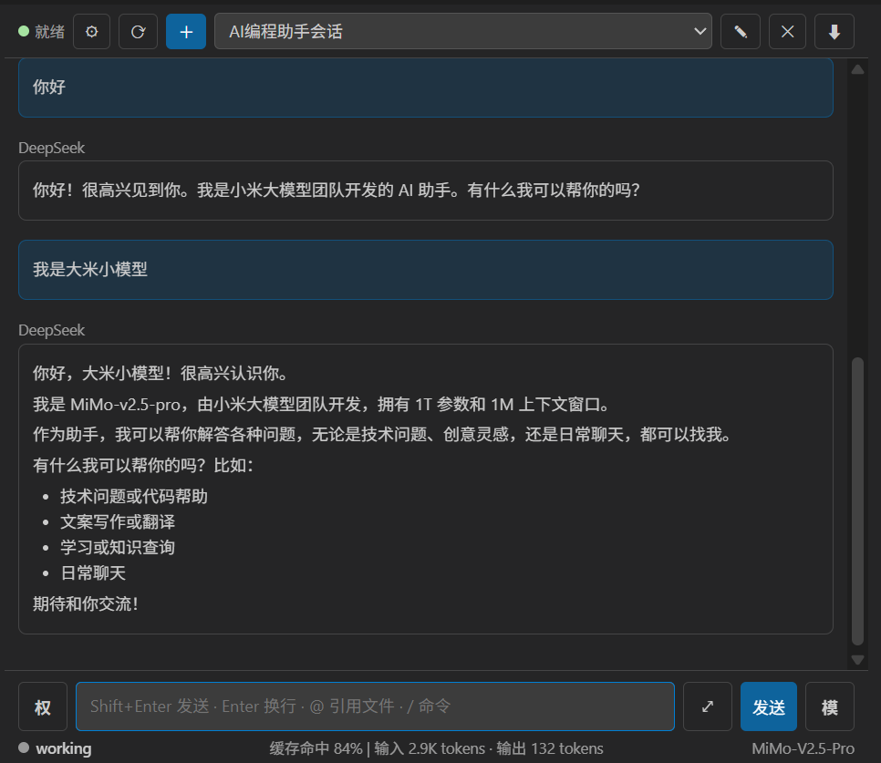

# DeepSeek Harness Chat (dsh-vsc-weblike)

[中文](#中文) | [English](#english)

将 DeepSeek Harness（dsh）的能力接入 VS Code，提供 Claude Code 风格的侧边栏与工作区面板界面。插件不内嵌 dsh Web 前端，而是通过 HTTP RPC 与双 WebSocket 事件流直接与 dsh 后端通信。

Bring DeepSeek Harness (dsh) into VS Code with a Claude Code-style sidebar and workspace panel. The extension does not embed the dsh web frontend; instead it talks directly to the dsh backend over HTTP RPC and dual WebSocket event streams.



---

## 中文

### 一、核心功能

#### 1. dsh 实例生命周期管理
- 自动发现 dsh：配置路径 `dsh-vsc.dshPath` → `PATH` → npm 全局目录 → `npx --no-install @deepseek-ai/dsh`。
- 启动前检查是否已有 dsh web 在后台运行：
  - 显式 `dsh-vsc.dshUrl`
  - 状态文件 `~/.dsh/vscode-extension.json`
  - 默认地址 `http://127.0.0.1:3080`
- 若未运行，则自动启动 `dsh web --port 0`。
- VS Code 关闭时，自动退出由插件启动的 dsh 实例；复用已有实例时仅断开连接。
- 状态徽标实时显示：发现中 / 启动中 / 就绪 / 重连中 / 停止 / 错误；停止/错误状态可点击重新检测 dsh web 实例。

#### 2. 工作区与会话管理
- 自动将当前 VS Code 工作目录加入 dsh 工作区。
  - 已存在：按 canonical path 匹配后直接使用。
  - 不存在：打开插件界面时弹出确认框（启动阶段不打扰，后台静默初始化），经用户确认后创建。
  - 未添加工作区时，聊天区显示"没有打开的工作区，无法开始会话。"提示及"将当前文件夹添加到DSH工作区"按钮，点击后重新弹出确认框。
  - VS Code 工作区文件夹变化时自动重新映射。
- 会话列表、选择、新建、重命名。
- 首次创建工作区且无会话时，自动创建并选中空白"新会话"（下拉不再显示"暂无会话"），聊天区显示"新会话已就绪。输入消息开始与 DeepSeek Harness 对话。"及工作模式选择。
- 新会话内选择工作模式：标准 / PTC / 极简 / 创造。
- 归档/关闭会话：
  - 操作前二次确认。
  - 归档副本保存到当前工作目录 `.dsh-vsc/archived-sessions/`。
- 会话标题 fallback 优化，不再显示裸 `session-`。

#### 3. 聊天界面与会话内容显示
- 简洁会话 / 详细会话两种模式，默认简洁。
  - 简洁模式隐藏工具调用与思考流程，只保留用户、Assistant 最终输出与命令节点。
  - 简洁模式下底部统计行为同一行：左侧常驻 `working` 标识（圆点颜色表示会话状态：灰 = 空闲、绿 = 思考中、红 = 工具调用中、蓝 = 输出中）、居中 LLM 统计信息（缓存命中 / 输入输出）、右下角当前模型与推理强度。
- 流式 Assistant 输出。
- 工具调用与工具结果按 `callId` 配对。
- `/` 命令执行结果以命令节点展示（`command/run` → `command/done`，含成功/失败信息）。
- 上下文注入默认折叠，只保留最新一条。
- 向上翻页时提供“加载更早”按钮，按需加载更早历史。
- Markdown 渲染：
  - 标题、段落、粗体、斜体、删除线。
  - 行内代码与围栏代码块（可带语言 class），并对常见语言提供轻量语法高亮（关键字/字符串/注释/数字）。
  - 有序/无序列表（可嵌套）。
  - 引用块、分割线。
  - GFM 表格（支持对齐）。
  - 链接、图片。
  - 轻量 LaTeX 公式子集：`$...$` 行内公式、`$$...$$` 块级公式、分式、根号、上下标、希腊字母、常见运算符。
  - HTML 先转义再渲染，保证内容安全。

#### 4. Composer 输入区
- 发送方式可配置：
  - `Shift+Enter` 发送，`Enter` 换行（默认）。
  - 或反过来：`Enter` 发送，`Shift+Enter` 换行。
- 输入框展开/收起：只有输入框向上展开，附近按钮位置不变。
- 停止按钮使用 `■` 图标。
- `@` 文件引用：输入 `@` 弹出当前工作区文件列表，实时过滤。
- 图片发送（vision，两种方式）：① 输入框粘贴截图/图片（PNG/JPEG/WebP）；② 输入框左侧 **📷 选择图片**按钮（打开本地文件对话框，本机/远程环境都可靠）。图片会以缩略图显示在输入框上方（可逐张移除，发送按钮显示 🖼N 角标，添加成功有"已添加 N 张图片"提示），发送时随消息作为 `image` 附件提交给模型（配合 `deepseek-v4-flash-vision-exp` 等视觉模型使用）；部分远程环境剪贴板拿不到图片文件时会自动尝试 Clipboard API 兜底；若命令不接受图片附件会在发送前提示。（拖拽添加图片因 VS Code webview 平台限制不稳定，已移除。）
- `/` 命令菜单：输入 `/` 弹出 dsh 命令列表。
- `/` 命令执行：发送以 `/` 开头的完整命令行时直接调用 `commands/execute`——已注册命令被 host 执行（不会作为普通对话发给模型，结果以命令节点显示在会话中）；未注册命令返回空（`undefined`），与 web 端一致按普通消息发送；旧版 dsh 不支持命令 RPC 时自动回退普通消息。
- 发送队列显示：显示“排队中”队列，支持编辑、插话（steer）、删除。
- 模型与推理强度合并为一个 `模` 按钮，支持自定义模型名称。
- 权限选择压缩为输入框左侧 `权` 按钮。
- 上下文占用：以输入框背景按占用比例填充显示，悬停输入框可见具体百分比；可在设置中关闭，并可自定义进度条颜色（默认与用户消息框同色）。
- 底部统计行（同一行，左起 working 指示器、居中缓存命中与输入输出、右下角当前模型与推理强度）：
  - 中文：`缓存命中 42% | 输入 12.3K tokens · 输出 2.1K tokens`
  - 英文：`cache hit 42% | input 12.3K tokens · output 2.1K tokens`
  - 右下角模型信息：`Deepseek V4 Flash | Max`（模型名 | 推理强度，无推理强度时只显示模型名）。

#### 5. 工具审批 / 计划条 / 权限 / 问题 / 命令节点
- 工具审批（Approval）：输入框区域切换为审批面板，支持 `允许一次` / `拒绝`。
- 计划条（Todo）：展示计划列表与状态统计。
- 权限选择（Permission）：读取 dsh `permissions` 投影，切换时执行 `/permission <preset>`。
- 命令节点：`/` 命令执行后，会话中显示命令行与执行结果（成功/失败），简洁模式同样保留。
- 问题与计划评审：
  - Plan Review：支持批准 / 拒绝 / 聊一聊。
  - Ask User：支持单选、多选；带选项的问题同时提供"自定义回答"输入框（单选时自定义回答优先于选项，多选时两者可同时提交），无选项的问题直接自由输入。

#### 6. 设置面板
- 打开方式：点击顶部 `⚙`。
- 会话显示模式：简洁 / 详细。
- 字体大小：12–20 px。
- 内容最大宽度：不限制 / 800 / 1000 / 1200 / 1600 px（大屏时内容居中，不占满工作区）。
- 上下文占用（含子设置：进度条颜色、进度条透明度）：开 / 关（输入框背景占用指示）。
  - 进度条颜色：默认（与用户消息框相同）/ 自定义颜色。
  - 进度条透明度：0–100%（滑杆调节）。
- 界面语言：中文 / English。
- 发送方式：Enter 发送 / Shift+Enter 发送。
- 启动行为：启动 VS Code 时自动启动 dsh web（开/关）；启动时自动打开面板（开/关）。
- 打开 settings.yaml（在 VS Code 内打开 `$DSH_HOME/settings.yaml`）。
- 显示当前插件版本号。
- dsh 服务地址：显示当前连接地址（超链接），点击在浏览器打开 dsh Web UI。
- 管理工作区：查看当前/全部 dsh 工作区（会话数显示为"工作中+已归档"，如 3（工作中）+4（已归档），工作中数字加粗）；"显示已归档会话"开关；重命名/删除工作区（删除需二次确认）。
- LLM 相关设置（API Key、Base URL 等）请移步 dsh Web UI 配置。

#### 7. 入口与命令
- 侧边栏鲸鱼图标入口。
- 工作区右上角 `dsh` 按钮入口：在当前编辑器列直接打开 dsh 面板（覆盖当前工作区）。
- VS Code 启动自动打开：需同时满足以下三个条件，才自动打开工作区 dsh 面板：
  - dsh web 已在运行（未运行时不自动打开）。
  - 当前目录已在 dsh 工作区中（新窗口/新目录不会自动弹出）。
  - 上次使用未关闭过面板（关闭后不再自动弹出，手动打开一次面板后恢复）。
- 命令：
  - `dsh: Open Chat`
  - `dsh: New Session`
  - `dsh: Refresh Sessions`
  - `dsh: Open Web UI in Browser`
  - `dsh: Open Chat Panel`

#### 8. 下载会话上下文
- 顶栏最右侧 `⬇` 按钮。
- 将当前会话导出为 Markdown 或 JSON。
- Markdown 仅保留用户消息与 Assistant 最终回复。

### 二、配置项

| 配置项 | 类型 | 默认值 | 说明 |
|---|---|---|---|
| `dsh-vsc.dshPath` | string/null | null | 显式指定 dsh 可执行文件路径 |
| `dsh-vsc.minDshVersion` | string | `0.1.0-rc.6` | 最低 dsh 版本要求 |
| `dsh-vsc.autoStart` | boolean | true | 启动 VS Code 时自动检查/生成 dsh 实例；关闭时仅复用已运行的实例，不自动生成 |
| `dsh-vsc.dshUrl` | string/null | null | 显式指定已运行的 dsh web 地址 |
| `dsh-vsc.sessionDisplay` | string | concise | 会话显示模式：concise / detailed |
| `dsh-vsc.fontSize` | number | 13 | 聊天界面字体大小（px） |
| `dsh-vsc.maxWidth` | number | 1000 | 聊天内容最大宽度（px），0 = 不限制（占满面板） |
| `dsh-vsc.showContextUsage` | boolean | true | 是否在输入框中以背景填充显示上下文占用信息 |
| `dsh-vsc.contextBarColor` | string | `var(--accent)` | 上下文进度条颜色（CSS 颜色值，默认与用户消息框同色） |
| `dsh-vsc.contextBarOpacity` | number | 30 | 上下文进度条填充不透明度（%，0–100） |
| `dsh-vsc.language` | string | zh | 插件界面语言：zh / en |
| `dsh-vsc.autoOpenChat` | boolean | true | 检测到 dsh 已运行时，启动后自动打开工作区面板 |
| `dsh-vsc.showArchivedSessions` | boolean | false | 是否在会话列表中显示已归档会话（默认隐藏） |
| `dsh-vsc.enterToSend` | boolean | false | Enter 键行为：false（默认）= Shift+Enter 发送、Enter 换行；true = Enter 发送 |

### 三、运行环境

- VS Code >= 1.90
- Node >= 22（扩展宿主需提供全局 `WebSocket`；旧版宿主请确保可加载 `ws` 包）
- 已安装 `@deepseek-ai/dsh` 且版本 >= 0.1.0-rc.6

### 四、开发与打包

无需构建：入口直接使用 `src/extension.js`。

```bash
# 运行测试
node --test tests/*.test.js
```

打包分两步：

```bash
# 1. 安装 vsce（仅首次需要）
npm install -g @vscode/vsce

# 2. 运行 vsce 打包
vsce package
```

### 五、已知限制

- Markdown 渲染暂不支持完整 KaTeX 公式；当前为轻量 LaTeX 子集，代码高亮为轻量实现，不覆盖所有语言。
- `@` 文件引用排除了 `node_modules` 与 `.git`，且最多枚举 2000 个文件。
- 工作模式选择目前仍内嵌在空白会话页面，尚未改为模态框。
- `ws` 依赖未显式声明；旧版 VS Code 宿主若无全局 WebSocket 则需额外安装 `ws`。
- 权限切换受 dsh 后端保护：会话存在打开/创建中的持久终端时不能切换，需先关闭终端。

[切换到 English](#english)

---

## English

### 1. Core Features

#### 1.1 dsh Instance Lifecycle Management
- Auto-discovery of dsh: config path `dsh-vsc.dshPath` → `PATH` → npm global directory → `npx --no-install @deepseek-ai/dsh`.
- Before starting, checks whether a dsh web instance is already running:
  - explicit `dsh-vsc.dshUrl`
  - state file `~/.dsh/vscode-extension.json`
  - default address `http://127.0.0.1:3080`
- If not running, automatically starts `dsh web --port 0`.
- When VS Code closes, the extension automatically exits the dsh instance it started; when reusing an existing instance, it only disconnects.
- Status badge updates in real time: discovering / starting / ready / reconnecting / stopped / error; click it in the stopped/error state to re-detect the dsh web instance.

#### 1.2 Workspace and Session Management
- Automatically adds the current VS Code workspace directory to the dsh workspace.
  - If it already exists: matched by canonical path and reused directly.
  - If not: a confirmation dialog appears when the plugin UI is opened (no prompt during startup; background initialization stays silent), and the workspace is created after user confirmation.
  - Without a workspace, the chat area shows "No workspace is open; the session cannot start." plus an "Add the current folder to the DSH workspace" button that re-opens the confirmation dialog.
  - Re-maps automatically when VS Code workspace folders change.
- Session list, selection, creation, and renaming.
- When a workspace is created for the first time with no sessions, a blank "New Session" is created and selected automatically (the dropdown no longer shows "No Sessions"), and the chat area shows "New session ready. Type a message to start chatting with DeepSeek Harness." along with the working-mode selection.
- Working mode selection in a new session: Standard / PTC / Minimal / Creative.
- Archive/close sessions:
  - Double confirmation before the operation.
  - Archived copies are saved to the current workspace `.dsh-vsc/archived-sessions/`.
- Improved session title fallback, no longer showing a bare `session-`.

#### 1.3 Chat Interface and Conversation Display
- Two display modes: concise / detailed, concise by default.
  - Concise mode hides tool calls and thinking traces, keeping only user messages, the Assistant's final output, and command nodes.
  - In concise mode, the bottom stats row is a single line: a persistent `working` indicator on the left (dot color shows session status: gray = idle, green = thinking, red = tool call, blue = streaming output), LLM stats in the center (cache hit / input-output), and the current model and reasoning effort at the bottom right.
- Streaming Assistant output.
- Tool calls and tool results are paired by `callId`.
- `/` command execution results are shown as command nodes (`command/run` → `command/done`, including success/failure information).
- Context injection is collapsed by default, keeping only the latest entry.
- A "Load earlier" button appears when scrolling up, loading earlier history on demand.
- Markdown rendering:
  - Headings, paragraphs, bold, italic, strikethrough.
  - Inline code and fenced code blocks (with optional language class), plus light syntax highlighting for common languages (keywords / strings / comments / numbers).
  - Ordered/unordered lists (nestable).
  - Blockquotes, horizontal rules.
  - GFM tables (with alignment support).
  - Links, images.
  - A lightweight LaTeX subset: `$...$` inline math, `$$...$$` block math, fractions, square roots, super/subscripts, Greek letters, and common operators.
  - HTML is escaped before rendering for content safety.

#### 1.4 Composer Input Area
- Configurable send behavior:
  - `Shift+Enter` to send, `Enter` for a newline (default).
  - Or the reverse: `Enter` to send, `Shift+Enter` for a newline.
- Input box expand/collapse: only the input box expands upward; nearby buttons stay in place.
- Stop button uses the `■` icon.
- `@` file references: typing `@` pops up a list of files in the current workspace, filtered in real time.
- Image sending (vision, two ways): ① paste a screenshot/image (PNG/JPEG/WebP) into the input box; ② use the **📷 Pick image** button on the left of the input box (opens the local file dialog — reliable on both local and remote). Images appear as thumbnails above the input (removable one by one; the Send button shows a 🖼N badge; a "Added N image(s)" notice confirms success), and are submitted as `image` attachments with the message (for vision models such as `deepseek-v4-flash-vision-exp`); in some remote environments where the clipboard exposes no image files, a Clipboard API fallback is attempted automatically; commands that do not accept image attachments are blocked with a notice before sending. (Drag-and-drop image insertion was removed — it was unstable due to VS Code webview platform limitations.)
- `/` command menu: typing `/` pops up the dsh command list.
- `/` command execution: sending a full command line starting with `/` calls `commands/execute` directly — registered commands are executed by the host (they are not sent to the model as normal conversation; results appear as command nodes in the session); unregistered commands return empty (`undefined`) and are sent as normal messages, matching the web frontend behavior; if an older dsh version doesn't support the command RPC, it automatically falls back to a normal message.
- Send queue display: shows a "queued" list supporting edit, steer (interrupt), and delete.
- Model and reasoning effort are merged into one `模` button; custom model names are supported.
- Permission selector is compressed into a `权` button on the left of the input box.
- Context usage: shown as background fill in the input box proportional to usage; hovering the input box reveals the exact percentage. It can be disabled in settings, and the progress bar color is customizable (default matches the user message box).
- Bottom stats row (single line: `working` indicator on the left, cache hit and input/output in the center, current model and reasoning effort at the bottom right):
  - Chinese: `缓存命中 42% | 输入 12.3K tokens · 输出 2.1K tokens`
  - English: `cache hit 42% | input 12.3K tokens · output 2.1K tokens`
  - Model info at the bottom right: `Deepseek V4 Flash | Max` (model name | reasoning effort; only the model name when there is no reasoning effort).

#### 1.5 Tool Approval / Todo Bar / Permissions / Questions / Command Nodes
- Tool approval: the input area switches to an approval panel, supporting `Allow once` / `Reject`.
- Todo bar: shows the plan list and status statistics.
- Permission: reads the dsh `permissions` projection; switching executes `/permission <preset>`.
- Command nodes: after a `/` command executes, the command line and its result (success/failure) are shown in the session, and are kept in concise mode as well.
- Questions and plan review:
  - Plan Review: supports Approve / Reject / Chat.
  - Ask User: supports single-choice and multi-choice; questions with options also provide a "custom answer" input (for single-choice, the custom answer takes priority over the options; for multi-choice, both can be submitted together). Questions without options accept free-form input.

#### 1.6 Settings Panel
- How to open: click the `⚙` icon at the top.
- Session display mode: concise / detailed.
- Font size: 12–20 px.
- Max content width: unlimited / 800 / 1000 / 1200 / 1600 px (content is centered on large screens instead of filling the whole panel).
- Context usage (with sub-settings: bar color, bar opacity): on / off (background usage indicator in the input box).
  - Bar color: default (same as the user message box) / custom color.
  - Bar opacity: 0–100% (slider).
- UI language: 中文 / English.
- Send behavior: Enter to send / Shift+Enter to send.
- Startup behavior: auto-start dsh web when VS Code starts (on/off); auto-open the panel on startup (on/off).
- Open settings.yaml (opens `$DSH_HOME/settings.yaml` inside VS Code).
- Shows the current extension version.
- dsh service URL: shows the current connection address (as a link); click to open the dsh Web UI in the browser.
- Manage workspaces: view the current/all dsh workspaces (session counts shown as "active+archived", e.g. 3 (active) + 4 (archived), with the active number bold); a "show archived sessions" toggle; rename/delete workspaces (deletion requires confirmation).
- LLM-related settings (API Key, Base URL, etc.) are configured in the dsh Web UI.

#### 1.7 Entry Points and Commands
- Sidebar whale icon entry.
- `dsh` button at the top right of the workspace: opens the dsh panel in the current editor column (overlaying the current workspace).
- Auto-open on VS Code startup: the workspace dsh panel opens automatically only when all of the following conditions hold:
  - A running dsh web instance is detected (no auto-open when it is not running).
  - The current directory is already in the dsh workspace (opening a new window/directory does not auto-open).
  - The panel was not closed last time (closing it disables auto-open until the user opens the panel manually once).
- Commands:
  - `dsh: Open Chat`
  - `dsh: New Session`
  - `dsh: Refresh Sessions`
  - `dsh: Open Web UI in Browser`
  - `dsh: Open Chat Panel`

#### 1.8 Download Session Context
- `⬇` button at the far right of the top bar.
- Exports the current session as Markdown or JSON.
- Markdown keeps only user messages and the Assistant's final replies.

### 2. Configuration

| Setting | Type | Default | Description |
|---|---|---|---|
| `dsh-vsc.dshPath` | string/null | null | Explicitly specify the dsh executable path |
| `dsh-vsc.minDshVersion` | string | `0.1.0-rc.6` | Minimum required dsh version |
| `dsh-vsc.autoStart` | boolean | true | Automatically check for/create a dsh instance when VS Code starts; when disabled, only reuses a running instance without spawning |
| `dsh-vsc.dshUrl` | string/null | null | Explicitly specify the URL of an already running dsh web instance |
| `dsh-vsc.sessionDisplay` | string | concise | Session display mode: concise / detailed |
| `dsh-vsc.fontSize` | number | 13 | Chat font size (px) |
| `dsh-vsc.maxWidth` | number | 1000 | Max chat content width (px); 0 = unlimited (fills the panel) |
| `dsh-vsc.showContextUsage` | boolean | true | Show context usage as background fill in the input box |
| `dsh-vsc.contextBarColor` | string | `var(--accent)` | Context progress bar color (CSS color value; default matches the user message box) |
| `dsh-vsc.contextBarOpacity` | number | 30 | Context progress bar fill opacity (%, 0–100) |
| `dsh-vsc.language` | string | zh | Extension UI language: zh / en |
| `dsh-vsc.autoOpenChat` | boolean | true | Auto-open the workspace panel on startup when dsh is already running |
| `dsh-vsc.showArchivedSessions` | boolean | false | Show archived sessions in the session list (hidden by default) |
| `dsh-vsc.enterToSend` | boolean | false | Enter key behavior: false (default) = Shift+Enter sends, Enter inserts a newline; true = Enter sends |

### 3. Requirements

- VS Code >= 1.90
- Node >= 22 (the extension host must provide a global `WebSocket`; on older hosts make sure the `ws` package can be loaded)
- `@deepseek-ai/dsh` installed, version >= 0.1.0-rc.6

### 4. Development and Packaging

No build step: the entry point directly uses `src/extension.js`.

```bash
# Run tests
node --test tests/*.test.js
```

Packaging takes two steps:

```bash
# 1. Install vsce (first time only)
npm install -g @vscode/vsce

# 2. Run vsce package
vsce package
```

### 5. Known Limitations

- Markdown rendering does not support full KaTeX yet; it currently provides a lightweight LaTeX subset, and syntax highlighting is a lightweight implementation that does not cover all languages.
- `@` file references exclude `node_modules` and `.git`, and enumerate at most 2000 files.
- Working mode selection is still embedded in the blank session page and has not been turned into a modal dialog.
- The `ws` dependency is not explicitly declared; older VS Code hosts without a global `WebSocket` need `ws` installed separately.
- Permission switching is protected by the dsh backend: it cannot be switched while a persistent terminal is being opened/created in the session; close the terminal first.

[切换到中文](#中文)

---

## 许可 / License

MIT
